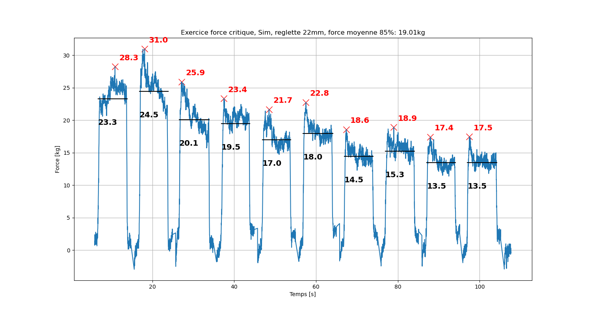

<!DOCTYPE html>
<meta charset="utf-8">
<html>
<h1>API de la poutre d'escalade XBoard</h1>

Cette API permet de lancer des exercices sur la poutre une fois que celle-ci est connectée.

<h1>Exemples d'exercices</h1>

Ci-dessous, quelques exercices sont proposés pour servir de base

<li>Démonstration des fonctionnalités</li>
./examples/force_critique.ipynb 
</img>

<li>Détermination de la force critique</li>
./examples/demo.ipynb
</html>